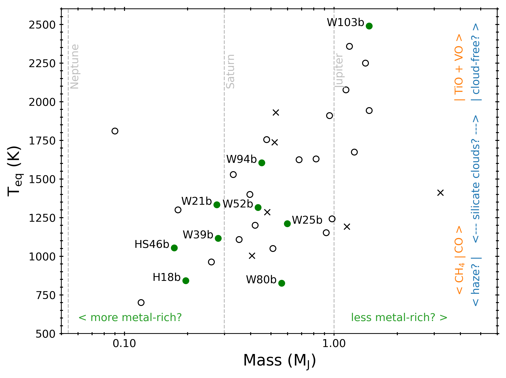
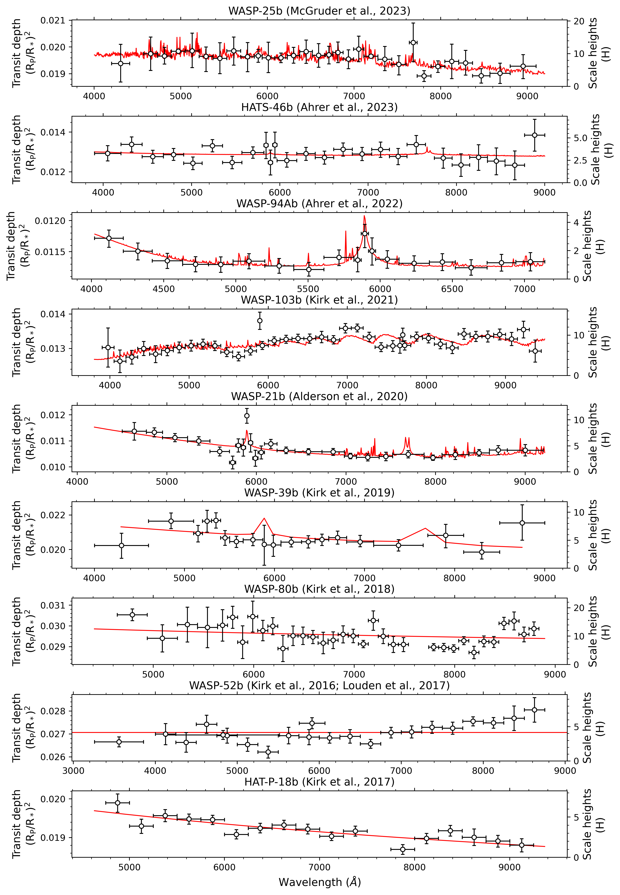

The goal of the **Low Resolution Ground-Based Exoplanet Survey using Transmission Spectroscopy (LRG-BEASTS, "large beasts")** is to measure the optical transmission spectra of a large sample of gas giant exoplanets to test how their atmospheric properties vary as a function of temperature and mass. Through LRG-BEASTS, we are also obtaining the optical data that is needed to help constrain the impacts of clouds, hazes, and stellar contamination in the infrared.

## The facilities

Ground-based studies are often limited by systematics and not photon noise, and so larger telescopes do not necessarily provide more precise spectra. For this reason, LRG-BEASTS is pioneering the use of 4-metre class telescopes to perform these observations. Specifically, LRG-BEASTS acquires data using the low-resolution (_R_ = 300) grism spectrographs [ACAM](https://www.ing.iac.es//astronomy/instruments/acam/) on the 4.2m William Herschel Telescope (WHT) in La Palma, and [EFOSC2](https://www.eso.org/sci/facilities/lasilla/instruments/efosc.html) on the 3.6m New Technology Telescope (NTT) in La Silla.

## The sample

The figure above shows the LRG-BEASTS sample. These 26 planets cover a wide range of parameter space from ~0.1 to 3.2 Jupiter masses and ~730 to 2500K. This broad parameter space is allowing us to analyse how a planet's atmospheric properties vary as functions of these parameters. The planets in green are those that have been published.

In *temperature* space, we are probing the transition between CH4 and CO at ~1000K. Below 1000K, the photolysis of CH4 produces hydrocarbon hazes in exoplanet atmospheres (e.g., [Morley et al., 2015](https://ui.adsabs.harvard.edu/#abs/2015ApJ...815..110M/abstract)), that can mute molecular absorption and lead to strong optical scattering slopes. Indeed, we have seen evidence for hydrocarbon hazes in the atmospheres of HAT-P-18b and WASP-80b (see *THE RESULTS*).

At intermediate temperatures between ~1000 and 2000K, silicate clouds are expected to be prevalent with a non-linear dependence on temperature ([Gao et al., 2020](https://ui.adsabs.harvard.edu/abs/2020NatAs...4..951G/abstract)). These clouds mute molecular features and can give rise to steep slopes or flat spectra at optical wavelengths depending on the size and vertical extent of the cloud particles (e.g., [Wakeford et al., 2015](https://ui.adsabs.harvard.edu/abs/2015A%26A...573A.122W/abstract)).

At the hottest temperatures, we are sensitive to the onset of TiO and VO absorption at ~2000K. Indeed in our study of WASP-103b, we saw evidence for TiO at 2 sigma confidence (see *THE RESULTS*). These hotter planets are also predicted to be clear/cloud-free (e.g., [Gao et al., 2020](https://ui.adsabs.harvard.edu/abs/2020NatAs...4..951G/abstract)). However, their high temperatures can lead to molecular dissociation which also reduces molecular spectral features (e.g., [Lothringer et al., 2018](https://ui.adsabs.harvard.edu/abs/2018ApJ...866...27L/abstract)), as we also found for WASP-103b.

In *mass* space, we are using our precise optical spectra to place tighter constraints on molecular abundances derived from HST and (future) JWST infrared data. By determining how the planets' metallicities vary as a function of mass, we will determine whether the planets show an inverse relationship between mass and metallicity, like the solar system gas giants, which would suggest these planets formed via core accretion (e.g., [Kreidberg et al., 2014](https://ui.adsabs.harvard.edu/abs/2014ApJ...793L..27K/abstract)).

## The results

The figure above shows the published results to date and demonstrates our ability to obtain a precision of around 1 atmospheric scale height with a 4-metre telescope. For all planets, the best fitting atmospheric forward model is plotted in red. The results are described in more detail below.

**- WASP-94Ab** ([Ahrer et al., 2022](https://arxiv.org/pdf/2201.02212.pdf))

In the most recent LRG-BEASTS study, Warwick graduate student Eva-Maria Ahrer led an analysis of the inflated hot Jupiter WASP-94Ab. In this study, Eva-Maria published the first transmission spectrum to use the EFOSC2 instrument on the 3.6m NTT telescope in La Silla, obtaining an exquisite precision of 128 ppm in 200A-wide bins from a single transit. Our precise transmission spectrum revealed significant evidence for sodium in the planet's atmosphere at 4.9 sigma confidence, in addition to a steeper-than-Rayleigh scattering slope. Our detection of pressure-broadened sodium suggests aerosols must be confined to relatively low altitudes. We also present archival HARPS data which reveals absorption in the stellar CaII H&K line cores, suggesting that WASP-94Ab may be losing its atmosphere, leading to cloud of gas that is enshrouding the host star.

**- WASP-103b** ([Kirk et al., 2021](https://arxiv.org/pdf/2105.00012.pdf))

In this study, we combined 11 ground-based transits (2 from LRG-BEASTS, 5 from the ACCESS survey on Magellan, 3 from Gemini/GMOS, and 1 from VLT/FORS2) for the ultrahot Jupiter WASP-103b. This combination of data led to one of the most precise ground-based transmission spectra to date with a median uncertainty in the transit depth of just 148 ppm in 150A-wide wavelength bins, which was less than the one atmospheric scale height amplitude of 152 ppm.

In our retrieval analysis of WASP-103b’s combined optical and HST infrared transmission spectrum, we found strong evidence for unocculted bright regions (4.3 sigma) and weak evidence for H2O (1.9 sigma, likely due to dissociation), HCN (1.7 sigma), and TiO (2.1 sigma), which could be responsible for WASP-103b’s observed temperature inversion ([Kreidberg et al., 2018](https://ui.adsabs.harvard.edu/abs/2018AJ....156...17K/abstract)). Our optical transmission spectrum showed significant structure that was in excellent agreement with the extensively studied ultrahot Jupiter WASP-121b ([Evans et al., 2018](https://ui.adsabs.harvard.edu/abs/2018AJ....156..283E/abstract)), for which the presence of VO was inferred. For WASP-103b, we found that VO could only provide a reasonable fit to the data if its abundance was implausibly high and we did not account for stellar activity. Our results highlighted the precision that can be achieved by ground-based observations and the impacts that stellar activity from F-type stars can have on the interpretation of exoplanet transmission spectra.

**- WASP-21b** ([Alderson et al., 2020](https://arxiv.org/pdf/2008.00971.pdf))

In work led by my master's student at the CfA, Lili Alderson, we presented the optical transmission spectrum of the highly inflated Saturn-mass exoplanet WASP-21b, using three transits obtained with the ACAM instrument on the WHT. Our transmission spectrum covered a wavelength range of 4635–9000A, achieving an average transit depth precision of 197 ppm, which was less than the one atmospheric scale height amplitude of 246 ppm. We detected sodium absorption in a 30A-wide bin at > 4 sigma confidence, with the wings of sodium extending over 100A. We saw no evidence of absorption from potassium, meaning WASP-21b joined the growing list of planets with only one of the alkali metals present.

Our atmospheric retrieval analysis of WASP-21b's steep optical scattering slope, which is very similar to the famous slope in HD 189733b's spectrum, indicated it is too steep for Rayleigh scattering from molecular hydrogen. We found the slope cannot be caused by stellar activity alone, with photometric monitoring of WASP-21 showing it to be an inactive star. We therefore concluded that aerosols in the atmosphere of WASP-21b gave rise to its steep slope. WASP-21b is an excellent target for infrared observations to constrain its atmospheric metallicity, particularly due to its identical mass to the JWST ERS target WASP-39b (read more below).

**- WASP-39b** ([Kirk et al., 2019](https://arxiv.org/pdf/1908.02358.pdf))

In my 2019 study of the highly inflated Saturn-mass planet WASP-39b, I combined a new WHT/ACAM transmission spectrum of WASP-39b with data from VLT, HST and Spitzer. The retrievals we ran on these data retrieved a highly super-solar metallicity atmosphere (282 +65 -58 x solar) driven by the large amplitude water feature ([Wakeford et al., 2018]((https://ui.adsabs.harvard.edu/#abs/2018AJ....155...29W/abstract))). This result highlighted the concerning impact that different retrieval algorithms can have on the inferred atmospheric metallicity, with previous literature results spanning many orders of magnitude. We concluded the differences in these inferred metallicities are likely due to the underlying model assumptions (particularly the choice of priors). Understanding these biases will be incredibly important when interpreting the JWST data of this planet that will be acquired through the Early Release Science Program.

**- WASP-80b** ([Kirk et al., 2018](https://ui.adsabs.harvard.edu/#abs/2018MNRAS.474..876K/abstract))

For WASP-80b, we ruled out a previously claimed potassium detection made by the VLT ([Sedaghati et al., 2017](https://ui.adsabs.harvard.edu/abs/2017MNRAS.468.3123S/abstract)), instead finding a hazy atmosphere consistent with GTC results ([Parviainen et al., 2018](https://ui.adsabs.harvard.edu/abs/2018A%26A...609A..33P/abstract)), demonstrating our ability to obtain spectra comparable to those from much larger telescopes. Our results for WASP-80b are consistent with the prediction that the planet should contain hydrocarbon hazes given its relatively cool temperature of ~850K.

**- WASP-52b** ([Kirk et al., 2016](http://adsabs.harvard.edu/abs/2016MNRAS.463.2922K) & [Louden et al., 2017](http://adsabs.harvard.edu/abs/2017MNRAS.470..742L))

In the case of WASP-52b, we found clouds in its atmosphere using ULTRACAM (Kirk et al., 2016), which was consistent with our later ACAM study (Louden et al., 2017). Our ULTRACAM study also revealed an in-transit anomaly which we deduced to be a result of the planet occulting a hot spot on the stellar surface. This was the first evidence of a facula crossing during an exoplanet transit. Since this study, a facula crossing has also been observed in a transit of the hot Jupiter WASP-19b, which was observed as part of the ACCESS survey ([Espinoza et al., 2019](https://ui.adsabs.harvard.edu/#abs/2019MNRAS.482.2065E/abstract)).

**- HAT-P-18b** ([Kirk et al., 2017](http://adsabs.harvard.edu/abs/2017MNRAS.468.3907K))

In the atmosphere of HAT-P-18b, we detected a clear Rayleigh scattering slope resulting from a high altitude haze in the planet's atmosphere. This was only the second discovery of a Rayleigh slope in a hot Jupiter atmosphere from the ground. Like WASP-80b, its equilibrium temperature of ~850K puts it in the temperature regime in which we expect hydrocarbon hazes to be prominent.

## News

Our results have also been highlighted by the Isaac Newton Group of Telescopes. Their press release concerning LRG-BEASTS can be found [here.](http://www.ing.iac.es/PR/press/kirk.html)
