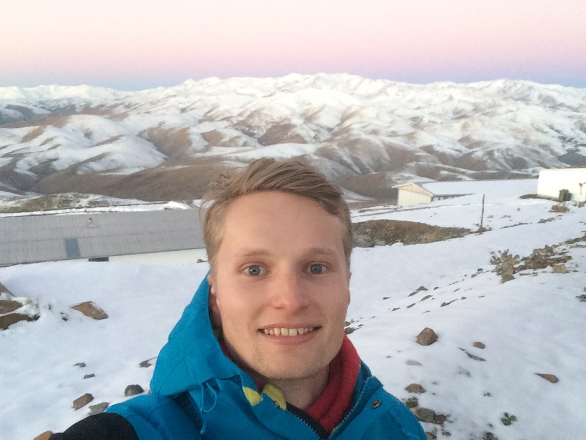

I am a postdoc working with Dr. Mercedes Lopez-Morales at the Center for Astrophysics, Harvard & Smithsonian. 

My primary research concerns the characterisation of exoplanet atmospheres using ground-based facilities such as [ACAM](http://www.ing.iac.es/Astronomy/instruments/acam/index.html) on the William Herschel Telescope and [EFOSC2](https://www.eso.org/sci/facilities/lasilla/instruments/efosc.html) on the New Technology Telescope.

During my PhD, my supervisor (Prof. Peter Wheatley) and I began the Low Resolution Ground-Based Exoplanet Atmosphere Survey using Transmission Spectroscopy (LRG-BEASTS, "large beasts") to characterise a large number of exoplanet atmospheres from the ground. For more information regarding this project click [here.](./LRG-BEASTS.html) 

Now that I'm at the CfA, I am now a part of the ACCESS survey that uses the Magellan telescope to observe exoplanet atmospheres. More information regarding ACCESS can be found [here.](https://project-access.github.io)

I have also been involved in the detection of exoplanets using K2 and WASP and worked on Be/X-ray binary systems during an undergraduate summer project. A full list of my publications can be found [here.](./publications.html)

## A brief CV:

**2018 October -- present: Center for Astrophysics, Harvard & Smithsonian, Cambridge, MA**

I recently started a postdoc as a member of Dr. Mercedes Lopez-Morales's team at the CfA. I continue to work on LRG-BEASTS and am also now an active member of the ACCESS survey to characterise exoplanet atmospheres.

**2014 October -- 2018 August: University of Warwick, UK - PhD Astronomy**

Thesis title: _Optical transmission spectroscopy of hot Jupiter atmospheres_  
Advisor: Prof. Peter J. Wheatley  

A copy of my PhD thesis can be found on the University of Warwick's online archive [here](https://wrap.warwick.ac.uk/111014/).

**2013 September -- 2014 May: Center for Astrophysics, Harvard & Smithsonian, Cambridge, MA**

Master's thesis: _Characterising the Protostars in the Herschel survey of Cygnus-X_  
Advisor: Dr. Joe Hora 

I enjoyed a previous stint at the CfA thanks to the University of Southampton's scholarship scheme whereby I spent my final year conducting research at the CfA which formed my master's thesis. This was an amazing experience and I am truly grateful to the University of Southampton and the Harvard-Smithsonian Center for Astrophysics for this opportunity.

**2010 September -- 2014 July: University of Southampton, UK - MPhys Physics with Astrophysics**

Graduated with a first class degree.

  Me at a very snowy La Silla Observatory, Chile, in August 2017.

Page last modified on: 03/12/18
