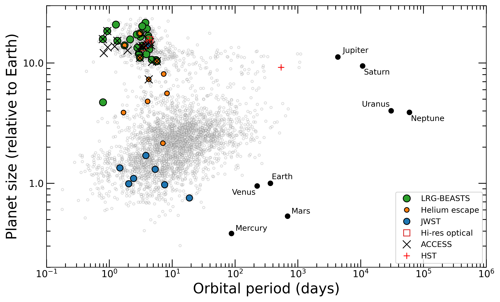

  

My research focusses on understanding the chemical and physical properties of exoplanet atmospheres by combining the technique of transmission spectroscopy with detailed retrieval analyses. By doing so, I aim to determine why the population of exoplanets is so diverse and in such stark contrast to the planets in our Solar System.

In the plot below, I show the population of **transiting** exoplanets (in grey) on a plot of orbital period against planetary size. This demonstrates how the vast majority of transiting exoplanets have shorter orbital periods than Mercury and have sizes between the Earth and Neptune.

On this plot, I also indicate the planets that I am studying and the observatory/method I am using to observe them. I go into a little more detail about these below the plot.

  

I am heavily involved in the JWST Transiting Exoplanet Early Release Science program to observe exoplanet atmospheres and was one of the key contributors to the recent [first detection of carbon dioxide in an exoplanet atmosphere](https://www.cfa.harvard.edu/news/astronomers-detect-carbon-dioxide-planet-first-time-jwst).

In addition to my work with JWST, I am leading several projects on ground-based telescopes, from acquiring precise optical transmission spectra of gas giants via the [LRG-BEASTS](./LRG-BEASTS.html) survey, to studying the atmospheric loss of exoplanets via [observations of helium at 1083nm](https://ui.adsabs.harvard.edu/abs/2020arXiv200107667K/abstract) using Keck and Magellan, to obtaining high-resolution optical transmission spectra of hot Jupiters using [Magellan/MIKE](https://ui.adsabs.harvard.edu/abs/2003SPIE.4841.1694B/abstract). I am also an active member of the [ACCESS](http://project-access.space/) transmission spectroscopy survey of transiting exoplanets.

My personal ADS library can be found [here.](https://ui.adsabs.harvard.edu/#/public-libraries/mgPwhEXXSaSPC7QqWMQ6vw)
